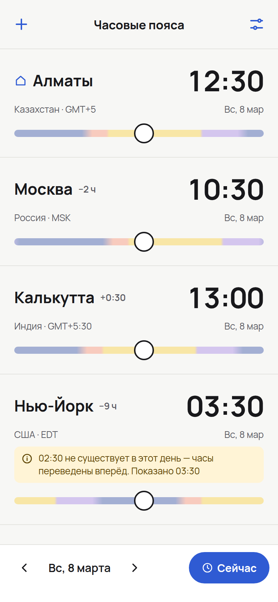
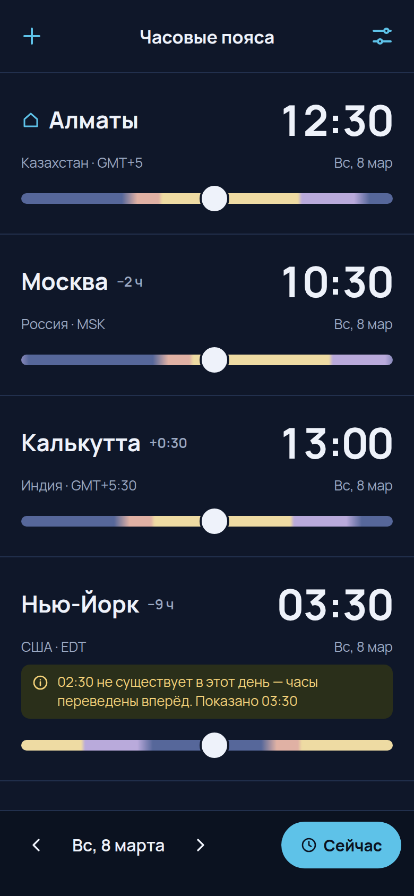
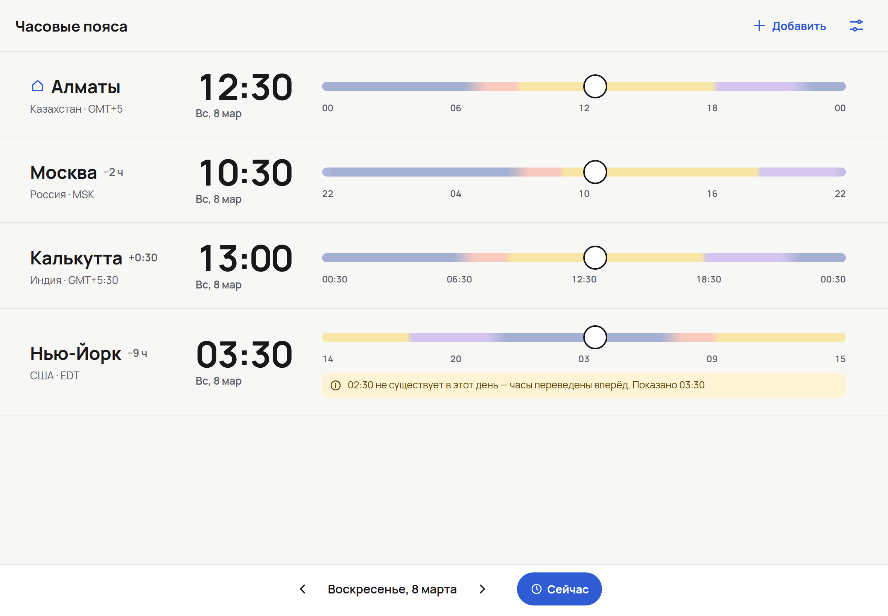

# Time Zones

[](LICENSE)

[](README.md)
[](README.ru.md)

Cross-device PWA for world clock, time zone conversion and meeting planning. Client-only and offline-first — no account, no server, your data stays on your device.

**Live:** <https://oinsio.github.io/time-zones/> — installable to the home screen, works offline after the first visit.

## Contents

- [Screenshots](#screenshots)
- [MVP Features](#mvp-features)
- [Localization](#localization)
- [Tech Stack](#tech-stack)
- [Development](#development)
- [Deployment](#deployment)
- [Gnomish Factory](#gnomish-factory)
- [License](#license)

## Screenshots

The Cards view on phone and tablet. Details: [docs/design](docs/design/README.md).

<table>
  <tr>
    <td align="center"></td>
    <td align="center"></td>
  </tr>
  <tr>
    <td align="center">Light theme</td>
    <td align="center">Dark theme</td>
  </tr>
</table>



## MVP Features

1. **Locations** — add and remove locations via search by city, country or time zone abbreviation (`EST`, `IST`). Each location is stored by its IANA identifier (`"Europe/Moscow"`), never by a raw UTC offset.
2. **Persistence** — the list of locations is saved on the device and restored on the next visit, fully offline.
3. **Home location** — optionally mark one location as home; every location shows its difference from it (`+3h`, `−5:30h`). Without home, differences are counted from the device time, which is always shown as the "Here" entry.
4. **Day-night comparison** — every location is a card with its time and a slider colored by its local time of day (night / morning / working hours / evening), with the day boundary marked.
5. **Time selection** — drag the slider or type a time in any location; all other locations are recalculated.
6. **Date selection** — pick a date; UTC offsets and daylight saving time are resolved for the selected date, not for today.
7. **12/24-hour format** — switch between 12-hour and 24-hour time.

## Localization

Russian and English are supported from the start. The locale system is built to be extended with new languages without code changes:

- **Auto-discovered locale files** — every `src/locales/<code>.json` is picked up automatically. Each file carries a `_meta` block (`code`, `name`, `nativeName`, `baseLanguage`, `emoji`); `_meta.code` must match the file name.
- **Adding a language** — drop a new locale file with a full set of keys; it appears in the language switcher.
- **Easter-egg dialects** — themed locales override only some keys of their `baseLanguage` and fall back to it for everything else, including plural rules.
- **Language detection** — on first visit the browser language is used (`en-US` → `en`); the user's choice is then persisted locally.

## Tech Stack

- React 18, TypeScript, Vite, Tailwind CSS
- Temporal API (`temporal-polyfill`) for all date/time math
- i18next + react-i18next
- PWA via `vite-plugin-pwa` (Workbox)
- Testing: Vitest, vitest-cucumber (BDD unit), playwright-bdd (BDD E2E), axe-core, Stryker (mutation)

## Development

Requires Node.js >= 20 and pnpm >= 9.

```bash
pnpm install
pnpm dev          # start dev server
pnpm build        # production build
pnpm --filter @time-zones/client preview   # serve the production build (with the service worker)
pnpm preflight    # lint + typecheck + tests
```

The app is served under `/time-zones/` in every mode (dev, preview, production), so open `http://localhost:<port>/time-zones/`. The base path is defined once in [`packages/client/app.config.ts`](packages/client/app.config.ts).

### Replacing the logo

All icons (favicon, Apple touch icon, 192/512 px and maskable manifest icons) are generated during the build from one image. To change the logo, replace [`packages/client/assets/app-icon-source.jpg`](packages/client/assets/app-icon-source.jpg) with a square image (at least 512×512 px) and run `pnpm build` — no other edits are needed. Padding and background of the maskable icon are set in [`packages/client/pwa-assets.config.ts`](packages/client/pwa-assets.config.ts).

Features are developed with [OpenSpec](openspec/): `/opsx:propose` → `/opsx:apply` → `/opsx:archive`.

## Deployment

- Every pull request runs [CI](.github/workflows/ci.yml): lint, typecheck, unit tests, production build, initial JS budget (150 KB gzipped), a check that the build left sources untouched, and the smoke E2E.
- Every push to `main` runs the same checks and, only if they pass, [deploys](.github/workflows/deploy.yml) the build to GitHub Pages. A failed check leaves the previous version live; rollback is a revert on `main`.

## Gnomish Factory

[Gnomish Factory](https://github.com/oinsio/gnomish-factory) runs AI agents ("gnomes") through a pipeline of declarative stages that live in this repository. Every stage ends in automated checks and an LLM judge; a stage that keeps failing escalates to a human instead of shipping. The whole setup lives in [`.gnomish/`](.gnomish/):

| Path             | What it is                                                                                                  |
|------------------|-------------------------------------------------------------------------------------------------------------|
| `config.yaml`    | tracker (GitHub issues of `oinsio/time-zones`), attempt limit, WIP limit, labels                            |
| `pipeline.yaml`  | stage order                                                                                                 |
| `stages/<name>/` | one stage: `stage.yaml` (executor, checks), `instructions.md` (the brief), `acceptance.md` (judge criteria) |
| `factory/`       | everything that launches the factory, next to the pipeline rather than part of it — see below               |

`factory/` holds:

| Path                | What it is                                                                       |
|---------------------|----------------------------------------------------------------------------------|
| `gnomish`           | wrapper script — the only way to run the factory here                            |
| `gnomish-up`        | `serve` plus a live dashboard and the INFO log in one terminal, via the wrapper  |
| `gnomish.env`       | this instance's settings: instance name, host binding, log and secrets locations |
| `gnomish.local.env` | optional personal overrides of `gnomish.env`, git-ignored                        |
| `gnomish.jar`       | the factory build, git-ignored, you put it there yourself                        |
| `sandbox/`          | Dockerfile of the box gnomes run in under the `container` binding                |
| `build-sandbox`     | builds that image with the tool versions this repository pins                    |

The pipeline ([`pipeline.yaml`](.gnomish/pipeline.yaml)) takes a task from an idea to a pull request in eight stages. Reviewers and the judges that arbitrate between reviewer and fixer run on Opus; the stages that write run on Sonnet.

| # | Stage          | What the gnome does                                                                                                              | Accepted when                                                                                                                            |
|---|----------------|----------------------------------------------------------------------------------------------------------------------------------|------------------------------------------------------------------------------------------------------------------------------------------|
| 1 | `specify`      | turns the task into exactly one OpenSpec change under `openspec/changes/` — the same procedure as `/opsx:propose`                | one active change, `openspec validate --changes --strict`, proposal sections and FR/M ids from [`.claude/rules/`](.claude/rules/), judge |
| 2 | `review-specs` | reviews the change for freshness, completeness and consistency and writes findings to `review-specs.md`, changing nothing else   | report sections, well-formed `R<n>` findings all `open`, no other file touched, judge                                                    |
| 3 | `fix-specs`    | fixes or rejects every finding with evidence, revising only files of the change                                                  | no `open` findings, a resolution for each, nothing outside the change, strict validation, judge                                          |
| 4 | `implement`    | implements the change in `packages/client` with TDD (`/opsx:apply`) and ticks every task                                         | all tasks ticked, 300-line cap, the CI steps: lint, typecheck, test, build, bundle size, BDD E2E; judge                                  |
| 5 | `review-code`  | reviews the implementation (tasks, requirements, scoped mutation runs) and writes findings to `review-code.md`, changing no code | same report format as `review-specs`, no other file touched, judge                                                                       |
| 6 | `fix-code`     | fixes the findings worth fixing with TDD, rejects the rest with evidence                                                         | no `open` findings, tasks stay ticked, the CI steps again, judge                                                                         |
| 7 | `archive`      | archives the change under `openspec/changes/archive/YYYY/MM/` and folds its spec deltas into `openspec/specs/`                   | no active change, grouped archive layout, `openspec validate --specs --strict`, judge                                                    |
| 8 | `deliver`      | opens (or updates) a pull request to `main` and mirrors its body into `pr-body.md`                                               | open PR to `main` with a real title, a body that references the issue and matches `pr-body.md`, judge                                    |

Every stage advances automatically (`advancement: auto`); after `autonomy.attemptLimit` (2) failed attempts the task escalates to a human. The checks compare the branch against `origin/main`, so `.gnomish/` itself has to be on `main` before the factory works tasks — see [Running](#running).

### One-time setup

1. **Java 25+ and the Claude Code CLI** (`claude`) on `PATH`.
2. **The jar.** Build it in a clone of the factory and copy it in; repeat after pulling factory updates:

   ```bash
   ./gradlew :bootstrap:bootJar   # in the gnomish-factory clone
   cp bootstrap/build/libs/bootstrap-0.1.0-SNAPSHOT.jar <time-zones>/.gnomish/factory/gnomish.jar
   ```

3. **The OpenSpec CLI, installed globally**, at the version pinned in `package.json` (`1.13.2`). The gnome works in a worktree outside this clone (`~/.gnomish/worktrees/time-zones/<task>`) where `node_modules` does not exist until the stage's first `pnpm install`:

   ```bash
   npm install -g @fission-ai/openspec@1.13.2   # or: brew install openspec
   openspec --version
   ```

4. **The project toolchain on the host** (host binding only — the Docker image carries its own): Node.js >= 20, pnpm, `gh` and `jq`, plus Playwright Chromium for the BDD E2E check of `implement` and `fix-code`:

   ```bash
   pnpm install
   pnpm --filter @time-zones/client exec playwright install chromium
   ```

5. **Secrets** — outside the clone, one file per secret, the file content is the bare value:

   ```bash
   mkdir -p ~/.gnomish/secrets/time-zones
   install -m 600 /dev/null ~/.gnomish/secrets/time-zones/github-token        # issues + labels read/write on this repo
   install -m 600 /dev/null ~/.gnomish/secrets/time-zones/github-pr-token     # optional: fine-grained, Contents + Pull requests
   install -m 600 /dev/null ~/.gnomish/secrets/time-zones/claude-oauth-token  # optional on the host, from `claude setup-token`
   ```

   `deliver` runs `gh` with `GH_TOKEN`, which the wrapper takes from `github-pr-token` or, without it, from `github-token` — so the gnome holds the tracker's rights unless a narrower PR token is present. Without `claude-oauth-token` the agent uses this machine's `claude` login.

### Running

The wrapper adds `--dir` (this project) and loads [`gnomish.env`](.gnomish/factory/gnomish.env): the instance name (`time-zones`), the host binding, the log directory. Change a setting there, in `gnomish.local.env`, in your shell (`GNOMISH_LOG_LEVEL=DEBUG .gnomish/factory/gnomish ...`) or with a flag (`--factory.instance-name=...`) — each outranks the one before it.

```bash
# One ad-hoc task, no tracker: branch gnomish/<task-id> in a worktree, the clone is not touched
.gnomish/factory/gnomish run --task="Add a meeting planner view"

# The same, but you play the gnome and the judge — a dry run of a stage you are editing
.gnomish/factory/gnomish run --task="..." --mode=in-place --interactive

# Tasks from GitHub issues: label an issue gnomish:ready, then
.gnomish/factory/gnomish take 42          # work that issue
.gnomish/factory/gnomish serve --drain    # work the whole ready queue, then exit

# The same daemon, but watchable: opens the dashboard in a browser and follows the INFO log
.gnomish/factory/gnomish-up               # serve flags pass through: --drain, --slots=2
.gnomish/factory/gnomish-up --no-open --no-logs

.gnomish/factory/gnomish status <task-id> # where a task is and what happened to it
```

`serve` and `take` read `tracker:` from the default branch and the stages from the task's base (`main`), so commit `.gnomish/` changes and merge them to `main` before they apply there. Start `run` from an up-to-date `main` too: `fix-specs`, `implement` and `fix-code` diff the branch against `origin/main`, and unmerged commits of another branch would count as the task's own changes.

Without `--base`, `run` reads `.gnomish/` from the working tree, so uncommitted edits to a stage take effect immediately. A finished task leaves a `gnomish/<task-id>` branch; squash-merge it so the round-by-round history stays on the branch. Logs: `~/.gnomish/logs/time-zones/gnomish.log`. Labels: `gnomish:ready` → `gnomish:working` → `gnomish:delivered`, or `gnomish:needs-human` when a task escalates.

### Running in Docker

By default [`gnomish.env`](.gnomish/factory/gnomish.env) pins `FACTORY_BINDINGS_DEFAULT=host`: every gnome process runs on this machine as you, with access to your files and no network restrictions. The `container` binding runs each task in an ephemeral Docker box instead, behind an egress guard that lets through only `api.anthropic.com`, `registry.npmjs.org` and `api.github.com`.

1. **Docker** running on this machine.
2. **The image**, built once and again whenever pnpm, openspec or Playwright change in the repository (bump the `FACTORY_SANDBOX_IMAGE` tag in `gnomish.env` then). It carries node 22, pnpm, openspec, the Claude Code CLI, `gh`, `jq` and Playwright Chromium at the versions `package.json` and `pnpm-lock.yaml` pin:

   ```bash
   .gnomish/factory/build-sandbox
   ```

3. **`claude-oauth-token`** in the secrets directory (or `ANTHROPIC_API_KEY` in the shell) — a box has no keychain, so the host login does not carry over.

### Switching between host and Docker

The mode is `FACTORY_BINDINGS_DEFAULT`: `host` or `container`. It can be set in four places; each one outranks the ones above it:

| Where                                   | Scope                    | Example                                                                  |
|-----------------------------------------|--------------------------|--------------------------------------------------------------------------|
| `gnomish.env`                           | everyone, committed      | `FACTORY_BINDINGS_DEFAULT=host` (the current default)                    |
| `gnomish.local.env`                     | you, git-ignored         | `FACTORY_BINDINGS_DEFAULT=container`                                     |
| shell variable                          | one run                  | `FACTORY_BINDINGS_DEFAULT=container .gnomish/factory/gnomish run ...`    |
| `--factory.bindings.default=...` flag   | one run                  | `.gnomish/factory/gnomish run ... --factory.bindings.default=container`  |

```bash
# Docker for good, just for you
echo 'FACTORY_BINDINGS_DEFAULT=container' > .gnomish/factory/gnomish.local.env

# back to the host: delete the file, or override it for one run
rm .gnomish/factory/gnomish.local.env
FACTORY_BINDINGS_DEFAULT=host .gnomish/factory/gnomish take 42

# Docker for one run only
FACTORY_BINDINGS_DEFAULT=container .gnomish/factory/gnomish run --task="..."
```

Prefer the variable over the flag: the wrapper's warning about a missing Claude credential in a box reads the variable only. Every stage of the pipeline runs in the same mode — the factory refuses a per-stage mix of `host` and `container`.

The Java 25 runtime and the jar stay on the host: the factory itself runs there and drives the boxes through Docker. A host a tool needs but the guard denies shows up as an `egress denial:` line in `gnomish status`; add it to `FACTORY_SANDBOX_EGRESSALLOWLIST` only once you know which tool asked for it.

Full reference: the factory's [operator guides](https://github.com/oinsio/gnomish-factory/tree/main/docs/guides) (`operator-guide.md` for the tracker, `-run.md` for `run`, `-serve.md` for `serve`).

## License

[Apache License 2.0](LICENSE)
