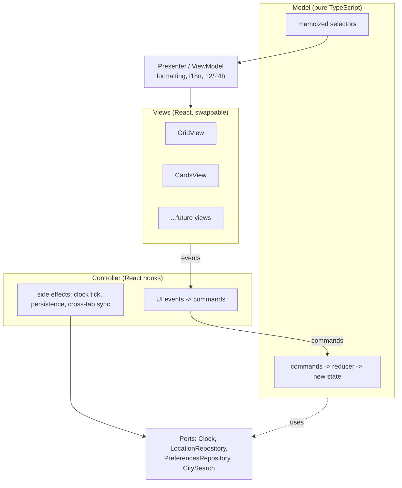

# ADR-0002: View-independent model with presenter and swappable views

## Status
Accepted (2026-09-28)
Refined by [ADR-0005](0005-view-registry.md) — view registry and `viewMode` values.

## Context

The app serves different tasks and devices:

- **Planning** — pick a meeting time that works across several time zones.
- **Converting** — "the meeting is at 08:00 UTC, what time is it for me?".
- **Glancing** — see the current time in several places.

It runs on phones (portrait and landscape), tablets and desktops. No single layout fits every task and every screen: an aligned hour grid is best for planning on wide screens, while large per-location cards are better for quick conversion on a narrow phone. Users should be able to choose the interface they prefer in settings.

This only works if every interface is a projection of the same state and logic. Any rule that leaks into a view has to be reimplemented in every other view.

## Decision

### Layers

1. **Model** — pure TypeScript, no React, no DOM, no i18n. It owns the domain state, validates invariants and exposes:
   - **Commands** — serializable objects with a `type` discriminator (enum), applied by a pure reducer `(state, command) -> result`. A result is either the new state or a typed domain error (`DUPLICATE_LOCATION`, `UNKNOWN_TIME_ZONE`, `LOCATION_NOT_FOUND`, ...). Commands never throw for expected domain failures.
   - **Selectors** — pure, memoized projections of state into view-agnostic data (Temporal values, enums, numbers). No strings meant for humans.
2. **Presenter (ViewModel)** — turns selector output into display-ready data: formatted times and dates, localized labels, 12/24h format. This is the only place that knows about the active language and hour format.
3. **Controller** — maps UI events to commands and runs side effects (clock tick, persistence, cross-tab sync). Views never call the reducer or ports directly.
4. **Views** — React components that render presenter output and emit events. A view owns only its own view state.
5. **Store** — the model lives in a framework-agnostic store with `subscribe` / `getSnapshot`; React reads it via `useSyncExternalStore`. Snapshots are immutable and referentially stable, so unchanged rows do not re-render on every clock tick.

### Three kinds of state

| Kind | Examples | Owner | Persisted |
|---|---|---|---|
| Domain | locations, home location, reference moment | Model | yes, except the reference moment |
| Preferences | language, hour format, view mode | Preferences model | yes |
| View | scroll position, open sheet, focused row | the view itself | no |

View state never goes into the model. Switching views keeps the domain state intact by construction.

### Swappable views

- `Preferences.viewMode` is `AUTO` or the id of a registered view (see [ADR-0005](0005-view-registry.md)).
- `AUTO` picks a view by the available container width, not by device type.
- Views share building blocks (row header, time display, day-period colors) as shared components — no per-view duplicates.

### View contract

Every view must:

- let the user select a time, select a date, return to "now", add and remove locations, set the home location, open settings;
- implement all UI states: loading, error, empty, offline;
- pass axe-core checks and be fully keyboard operable (Tab, Enter, Esc, arrows).

The contract is expressed as BDD E2E scenarios that run against **every** view — the same idea as contract tests shared by all adapters of a port. A new view cannot silently drop a capability.

## Consequences

Positive:
- The model is fully unit-testable with TDD, BDD and mutation testing, without rendering.
- New interfaces are added without touching domain logic.
- Commands as data enable logging, undo and deterministic replay in tests.
- The contract scenarios double as proof that the model is really view-independent.

Negative:
- More layers and files than a component-local `useState` approach.
- Memoization discipline is required, otherwise clock ticks cause full re-renders.
- Every view multiplies E2E run time by the number of views.

## Alternatives Considered

**Component-local state with hooks**: simplest start, but domain rules end up inside components and must be duplicated in each view.

**Global state library (Redux, Zustand)**: solves subscription, but ties the model to a library API. A small own store with `useSyncExternalStore` covers our needs; a library can be adopted later behind the same `subscribe` / `getSnapshot` interface.

**One adaptive view for all screens**: fewer components, but forces a compromise layout that is mediocre for both planning and quick conversion.

## Related

- [ADR-0003](0003-reference-instant-time-model.md) — time model
- [ADR-0004](0004-local-persistence-strategy.md) — persistence
- [ADR-0005](0005-view-registry.md) — view registry
- [Architecture overview](../architecture/overview.md)
