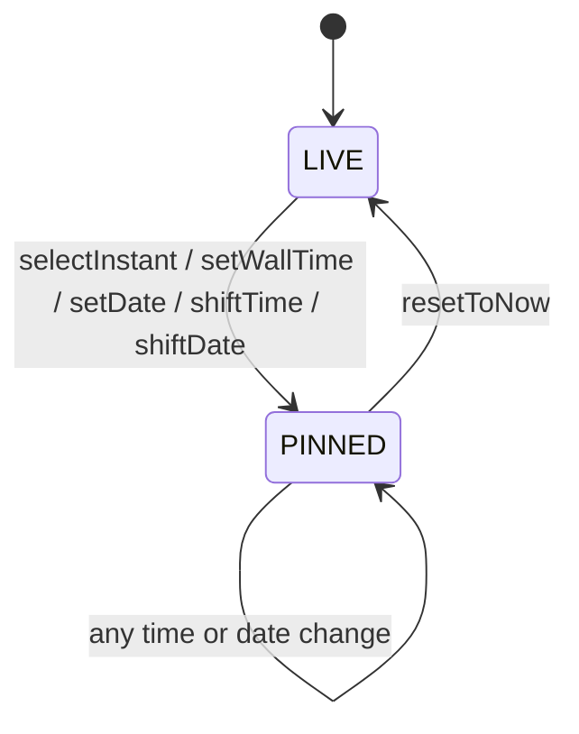

# ADR-0003: Reference instant as the single source of time

## Status
Accepted (2026-09-28)

## Context

Every screen answers one question: "what time is it in each location at a given moment?". The moment can be *now* or a moment the user picked — by tapping an hour, dragging a slider, typing "08:00" in some zone, or changing the date.

If the model stored a local time ("15:00 in Moscow"), every other location would have to be recomputed from it, and results would depend on which location was edited last. Local times are also ambiguous around daylight saving time (DST) transitions: some wall-clock times do not exist, others happen twice.

## Decision

### One absolute moment

The model stores a single **reference moment** as a `Temporal.Instant`. Everything else — local time, date, UTC offset, abbreviation, day period — is derived per location by selectors.

```
                 Instant 2026-09-28T08:00:00Z
                             |
         +-------------------+-------------------+
         v                   v                   v
    UTC 08:00          Moscow 11:00         Almaty 13:00
    Mon 28             Mon 28, UTC+3        Mon 28, UTC+5
```

"Plan a meeting" and "convert 08:00 UTC to my time" become the same operation: set the reference moment, read all locations.

### Two modes



- `LIVE` — the moment follows the clock.
- `PINNED` — the user fixed a moment.

The reference moment is not persisted: the app always opens in `LIVE`.

### Clock tick is a side effect

The model never runs timers. It reads "now" through the `Clock` port (`@/lib/temporal`). The controller:

- ticks on minute boundaries, not every 60 s from start;
- pauses while the page is hidden (`visibilitychange`) and re-reads the clock immediately when it becomes visible or the device wakes up.

### Wall-clock input and DST

Converting a wall-clock time to an instant (`setWallTime`, `setDate`) always passes an explicit `disambiguation: "compatible"` and reports a status:

| Status | Example (America/New_York) | Result |
|---|---|---|
| `UNIQUE` | 2026-06-01 10:00 | exact instant |
| `GAP` | 2026-03-08 02:30 (does not exist) | moved forward to 03:30; the view tells the user |
| `AMBIGUOUS` | 2026-11-01 01:30 (happens twice) | earlier instant; the view may offer the later one |

`setDate` keeps the wall-clock time of the **home** location.

### Hour cells are absolute hours

A local day is not always 24 hours: DST days have 23 or 25. Hour cells are therefore defined as consecutive one-hour spans of absolute time starting from the home location's midnight. Each location labels a cell with its own local start time, so:

- zones with :30 and :45 offsets (Asia/Kolkata +5:30, Asia/Kathmandu +5:45) show labels like `9:30`;
- differences from home are shown with minutes when needed (`-2:30`);
- the midnight cell of each location carries the new date.

### Time zone identifiers

- IANA IDs are the source of truth; raw offsets are never stored.
- IDs are canonicalized on input and on load (`Europe/Kiev` -> `Europe/Kyiv`, `Asia/Calcutta` -> `Asia/Kolkata`); duplicate detection compares canonical IDs.
- Abbreviations from `Intl` are for display only. Many zones have no abbreviation (`Intl` returns `GMT+5`), output depends on the locale, and abbreviations are ambiguous (`IST` = India, Israel, Ireland). Search by abbreviation uses our own mapping and returns every match.

## Consequences

Positive:
- One number drives all views; no "which location was edited last" bugs.
- DST gaps and overlaps are handled explicitly and are testable.
- Grid alignment stays correct on 23/25-hour days and for fractional offsets.

Negative:
- Every display value is computed, so selectors must be memoized.
- An own abbreviation mapping has to be maintained.

**Known limitation:** time zone rules come from the browser (`temporal-polyfill` uses `Intl`). An outdated browser may apply outdated DST rules. We accept this and do not ship our own tzdata.

## Alternatives Considered

**Store local time plus its zone**: natural for a single-zone app, but makes the edited location special and pushes DST handling into every view.

**Store a UTC offset**: breaks on the next DST transition; forbidden by project rules.

**Ship own tzdata**: always up to date, but adds size and an update pipeline for a rare problem.

## Related

- [ADR-0002](0002-model-presenter-swappable-views.md) — architecture layers
- [Domain model](../architecture/domain-model.md)
