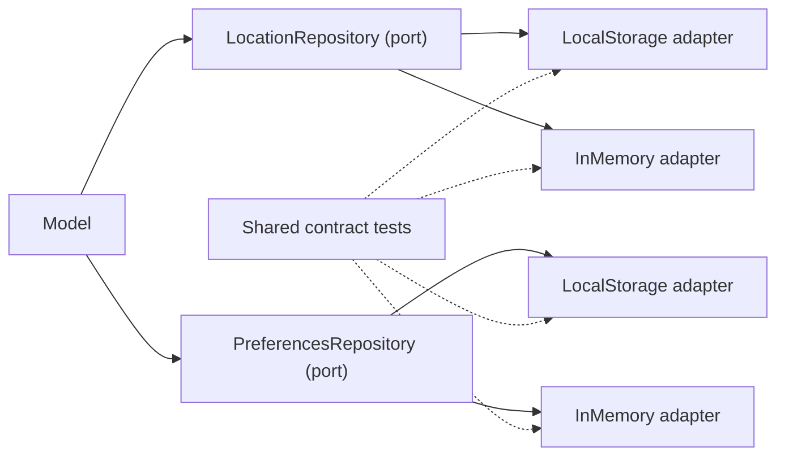
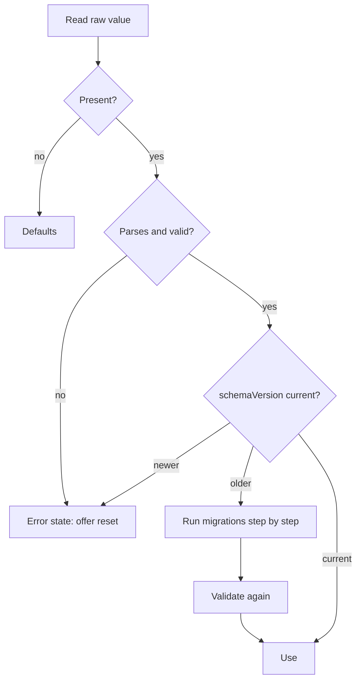

# ADR-0004: Local persistence strategy

## Status
Accepted (2026-09-28)

## Context

The app is client-only and offline-first: the list of locations and preferences live only on the user's device. There is no server to restore them from, so losing or corrupting local data means the user loses their setup.

Browsers do not help here: they do not migrate stored data, do not validate it, can refuse to store it (private mode, quota), may evict it (Safari removes data of non-installed sites after 7 days without a visit), and let several tabs overwrite each other.

## Decision

### Ports and adapters



- The model depends only on repository ports.
- Each port has at least a storage adapter and an in-memory adapter.
- One shared contract test suite runs against every adapter.
- Keys come from `STORAGE_KEYS` constants.

### Versioned schema from day one

Every stored document is an envelope:

```json
{ "schemaVersion": 1, "payload": { } }
```

On load:



- Migrations are pure functions `vN -> vN+1`, each covered by tests with fixtures of old data.
- Validation checks the whole payload, including that every time zone ID is still valid and canonical ([ADR-0003](0003-reference-instant-time-model.md)).
- Invalid data never crashes the app: the UI shows the error state with a reset action.

### Degraded mode

If storage is unavailable (private mode, quota exceeded, API throws), the app keeps working in memory and tells the user that changes will not be saved.

### Cross-tab sync

A PWA can be open in several tabs or windows. Writes are broadcast (`BroadcastChannel`, with the `storage` event as fallback); other tabs reload the changed document. Conflict policy: last write wins.

### Eviction protection

The app requests `navigator.storage.persist()` to reduce the risk of the browser evicting data, and the UI encourages installing the PWA on iOS.

### Writes

Writes are debounced and never block the UI; the reference moment is not persisted ([ADR-0003](0003-reference-instant-time-model.md)).

## Consequences

Positive:
- Stored data survives app updates thanks to migrations.
- Corrupted or foreign data leads to a recoverable error, not a white screen.
- Adapters can be swapped (e.g. IndexedDB) without touching the model.

Negative:
- Every schema change needs a migration and fixtures.
- Cross-tab sync adds a subscription path to test.

## Alternatives Considered

**Plain `localStorage` calls from components**: fastest to write, but no migrations, no validation and no tests without a browser.

**IndexedDB from the start**: more capacity and transactions, but the data is a few kilobytes; the port keeps this option open.

## Related

- [ADR-0002](0002-model-presenter-swappable-views.md) — architecture layers
