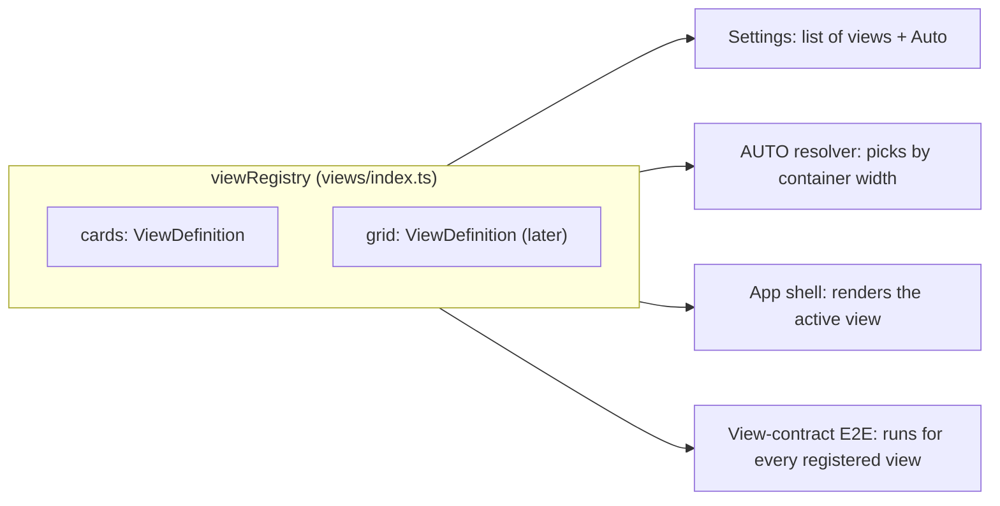

# ADR-0005: View registry for pluggable interfaces

## Status
Accepted (2026-09-28)

## Context

[ADR-0002](0002-model-presenter-swappable-views.md) established that interfaces are swappable projections of one model and that users choose the interface in settings. The first release ships a single view — Cards (per-location sliders) — because it is the simplest. The Grid and other views follow later.

Adding a view must stay cheap: no edits in the model, the settings screen, the `AUTO` logic or the test setup. Otherwise every new view turns into a cross-cutting change.

## Decision

Every view is described by a `ViewDefinition` and registered in a single registry in `views/index.ts`. Everything that needs to know about views reads the registry.



### ViewDefinition

```
ViewDefinition
  id             ViewId        "cards", "grid", ...
  titleKey       i18n key      name in settings
  icon           component
  component      lazy React component
  autoMinWidth   design token  minimum container width at which AUTO may pick it
```

### Rules

- **Settings** list the registered views plus `Auto`; a registered view appears in settings automatically.
- **AUTO** picks the registered view with the largest `autoMinWidth` that fits the container width. With one registered view, `AUTO` always resolves to it.
- **Preferences** store `viewMode` as `AUTO` or a `ViewId`. On load, a `ViewId` missing from the registry falls back to `AUTO` (validation per [ADR-0004](0004-local-persistence-strategy.md)).
- **Loading**: view components are lazy-loaded; an unused view does not add to the initial bundle.
- **Contract tests**: the view-contract BDD E2E scenarios are parameterized by the registry and run for every registered view.
- **Shared blocks**: views compose `views/shared/` components; a view folder contains only what is specific to it.

### Adding a view

```
1. create views/<name>/ with its component, stories and view-specific tests
2. add <name>View to viewRegistry
3. add the title key to every locale file
```

Nothing else changes: the model, controller, presenter, settings and contract tests pick it up.

## Consequences

Positive:
- A new view is a local change in one folder plus one registry entry.
- A new view cannot skip the contract scenarios.
- Initial load includes only the active view.

Negative:
- The registry is a small indirection to learn.
- E2E time grows with every registered view.

## Alternatives Considered

**Hard-coded switch over view modes in the app shell and settings**: fewer abstractions, but every new view edits several unrelated files and can forget the tests.

**Separate routes per view**: gives URLs, but the app has no routing and views are presentations of the same screen, not different pages.

## Related

- [ADR-0002](0002-model-presenter-swappable-views.md) — swappable views
- [Views](../architecture/views.md)
