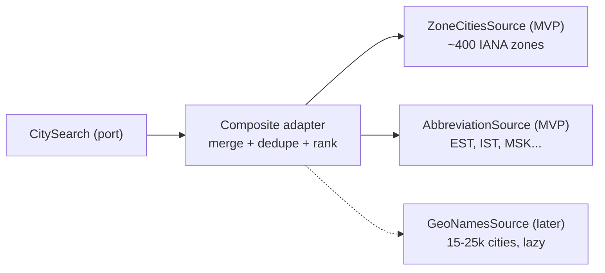

# ADR-0006: Pluggable city data sources for search

## Status
Accepted (2026-09-28)

## Context

Users add locations by searching for a city, a country or a time zone abbreviation. IANA provides about 400 time zone identifiers but no city database. A full city database (e.g. GeoNames with 15-25k cities, regions and localized names) weighs hundreds of kilobytes and needs a data pipeline and license review.

The first release should work with minimal data, and richer data must be addable later without touching the model or the views.

## Decision

Search goes through the `CitySearch` port. Its adapter combines any number of **city sources** that return records in one format.



### Record format

```
CityRecord
  id            string
  timeZoneId    canonical IANA ID
  names         { en: "Almaty", ru: "Алматы", ... }
  region?       { en, ru }              provided by richer sources
  countryCode   "KZ"                    country name comes from Intl.DisplayNames
  aliases       ["ALMT"]                abbreviations and alternative spellings
  rank          number                  capitals and large cities first
```

### Sources in the first release

- **ZoneCitiesSource** — one record per IANA zone from `Intl.supportedValuesOf("timeZone")`. Localized city names (RU, EN) are the exemplar cities of the Unicode CLDR (Common Locale Data Repository) time zone names, extracted at build time into a small JSON file. Country names come from `Intl.DisplayNames`. The availability of CLDR exemplar cities for every zone is verified in the first implementing step.
- **AbbreviationSource** — our own mapping of common abbreviations to zones; an ambiguous abbreviation (`IST`) returns every match ([ADR-0003](0003-reference-instant-time-model.md)).

### Composite adapter

- queries all sources, merges results, removes duplicates by canonical `timeZoneId` and name;
- ranks by match quality, then by `rank`;
- sources can be loaded lazily; while a lazy source loads, search shows the loading state and results from sources already available.

### Adding a source

Implement the source interface, register it in the composite adapter, run the shared source contract tests. The model, the port and the views do not change.

## Consequences

Positive:
- The first release has no runtime dependency on external data and stays small (tens of kilobytes).
- Richer data is a new source, not a rewrite.
- Every source passes the same contract tests.

Negative:
- Minimal data finds only representative cities of each zone: "Brooklyn" is not found, "New York" is.
- CLDR extraction adds a build step.

## Alternatives Considered

**GeoNames from the start**: best search quality, but large, needs a data pipeline and license handling before anything ships.

**Hard-coded list of popular cities**: small, but not systematic and needs manual translations.

## Related

- [ADR-0003](0003-reference-instant-time-model.md) — canonical IDs and abbreviations
- [ADR-0004](0004-local-persistence-strategy.md) — ports and contract tests
