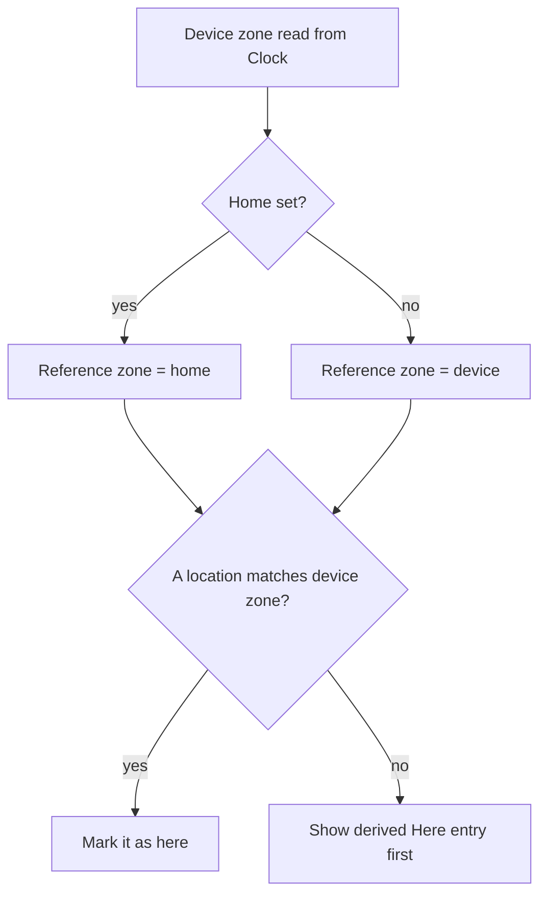

# ADR-0007: Reference zone — optional home, device time as fallback

## Status
Accepted (2026-09-28)

Refines [ADR-0003](0003-reference-instant-time-model.md): every place where ADR-0003 says "home location" now means the **reference zone** defined here.

## Context

ADR-0003 used the home location as the anchor for day boundaries, date changes and differences ("-2 h"). The home location was mandatory: the first added location became home, and the device time zone was added as home on first launch.

Not every user wants to mark a home city. Many only want to know "what time is it there compared to me", where "me" is the device. Travellers also need both at once: the time back home and the time where they are now.

Other apps solve this the same way:

| App | Behaviour |
|---|---|
| Apple Clock | no home at all; differences and "Today / Yesterday" are relative to the device |
| Apple Weather | a "My Location" entry is always first; it cannot be removed and is not part of the user's list |
| Android Clock | optional home time zone; "Automatic home clock" adds home while travelling |
| Time Buddy (mobile) | optional pinned home; an "Away" card appears when the device zone changes |
| Google Calendar | never switches the user's primary zone silently; it asks |

Browsers have no time zone change event yet, so the app has to re-read the device zone itself.

## Decision

### Reference zone

```
reference zone = home location's zone ?? device time zone
```

The reference zone defines:

- the day shown on every slider track and grid row (from its local midnight);
- the date kept by `SET_DATE` (wall-clock time in the reference zone);
- differences (`-2`, `+0:30`) and day shifts (`-1 / 0 / +1`) of every location.

### Home is optional

- Home is a mark the user sets or clears; the app never assigns it.
- Adding the first location does not make it home. Removing the home location clears home.

### "Here" marker

The device zone is always visible, so the user can read their own time at the selected moment:

- A location whose canonical zone ID equals the device zone gets a "here" mark (location arrow icon).
- If no location matches, a derived **Here** entry is shown first. It is built from the device zone and its exemplar city. It is not stored, cannot be removed and does not count as a location.
- If home is set and the device is elsewhere, the reference zone stays home; the Here entry shows the local time.



### Device zone is environment state

- The device zone is read only through the `Clock` port (`clock.timeZoneId()`), canonicalized, and passed to the model by the controller with `SET_DEVICE_TIME_ZONE`.
- The controller re-reads it on every clock tick and when the page becomes visible. The model never reads it directly.
- It is not persisted. An unknown value falls back to `UTC`.

### First launch

Nothing is added to the list. The Here entry shows the device time, so the screen is never empty and nothing is stored until the user acts.

## Consequences

Positive:
- The app is useful without any setup; home becomes an opt-in feature.
- Travelling needs no prompts: home stays stable and the Here entry shows local time.
- Selectors stay pure: the device zone arrives as state, like any other input, and is faked in tests via `fakeClock(instant, timeZone)`.

Negative:
- Without home, all differences change when the device zone changes (after a flight). This is expected but visible.
- The Here entry is a second kind of row that every view must render.
- Equality is by canonical zone ID: two IDs with identical rules (for example `Europe/Minsk` and `Europe/Moscow`) do not match, so the Here entry may appear next to a city with the same time.

## Alternatives Considered

**Keep home mandatory**: simplest model, but forces a choice many users do not care about and makes the device zone a stored location.

**Caption instead of the Here entry** ("Scale: device time, GMT+5"): shows the zone but not the user's own time at the selected moment, which is the main conversion question.

**Ask when the device zone changes** (Google Calendar): needed there because events move; here nothing stored changes, so a prompt is only noise.

**Match "here" by UTC offset** (Apple Clock "+0"): offsets change with DST, so the mark would jump; canonical IDs are stable.

## Related

- [ADR-0003](0003-reference-instant-time-model.md) — reference moment and DST
- [Domain model](../architecture/domain-model.md)
- [Views](../architecture/views.md)
