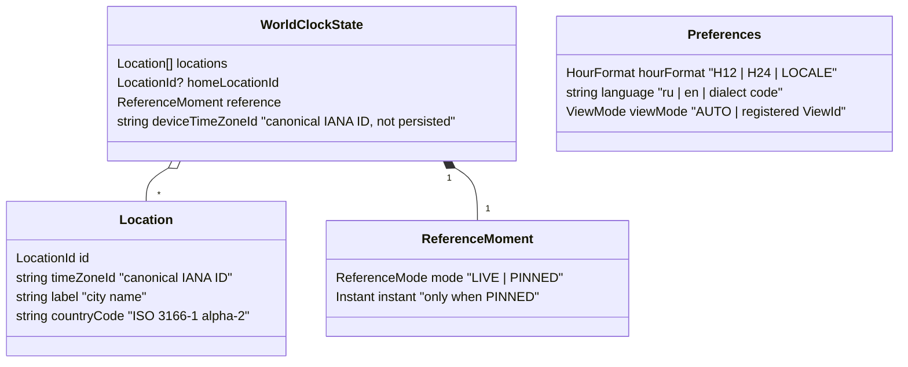
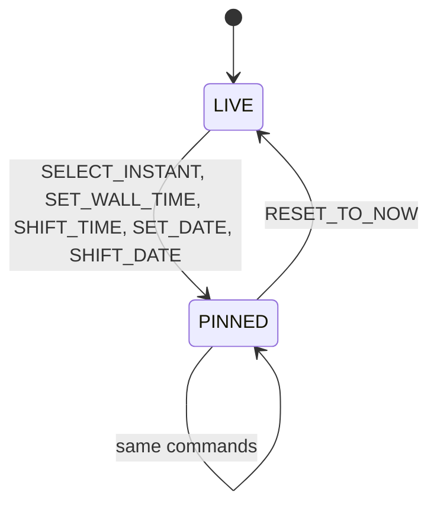

# Domain Model

The model is pure TypeScript with no dependency on React, the DOM, i18n or the presenter ([ADR-0002](../adr/0002-model-presenter-swappable-views.md)). Time semantics follow [ADR-0003](../adr/0003-reference-instant-time-model.md); the reference zone and the device time zone follow [ADR-0007](../adr/0007-reference-zone-and-device-time.md).

## State



- `locations` order is the display order.
- `reference` is not persisted; the app always starts in `LIVE`.
- `homeLocationId` is optional; the app never assigns it.
- `deviceTimeZoneId` is environment state: the controller reads it from the `Clock` port and sends `SET_DEVICE_TIME_ZONE`; it is not persisted.
- `Preferences` is a separate model with its own repository.
- `HourFormat.LOCALE` follows the conventions of the active language.
- `viewMode` holds `AUTO` or an id from the view registry ([ADR-0005](../adr/0005-view-registry.md)); an unknown id falls back to `AUTO` on load.

## Invariants

1. `homeLocationId` is empty or points to an existing location.
2. No two locations share the same canonical `timeZoneId` and `label`.
3. Every `timeZoneId` is a valid, canonical IANA identifier.
4. `reference.instant` is present if and only if `reference.mode` is `PINNED`.

## Commands

Commands are serializable objects with a `type` enum. The reducer returns either a new state or a typed error; it never throws for expected failures.

| Command | Effect | Errors |
|---|---|---|
| `ADD_LOCATION(timeZoneId, label, countryCode)` | appends a location; never sets home | `DUPLICATE_LOCATION`, `UNKNOWN_TIME_ZONE` |
| `REMOVE_LOCATION(id)` | removes it; if it was home, home becomes empty | `LOCATION_NOT_FOUND` |
| `SET_HOME_LOCATION(id \| null)` | marks a location as home or clears the mark | `LOCATION_NOT_FOUND` |
| `SET_DEVICE_TIME_ZONE(timeZoneId)` | updates the device zone (controller only); an unknown ID becomes `UTC` | — |
| `SELECT_INSTANT(instant)` | pins the moment (grid cell, slider) | — |
| `SET_WALL_TIME(locationId, time, date?)` | pins the moment for a wall-clock time in a location from the list | `LOCATION_NOT_FOUND` |
| `SHIFT_TIME(duration)` | moves the moment by a duration (keyboard: ±1 h, ±15 min) | — |
| `SET_DATE(date)` | changes the date, keeping the wall-clock time of the reference zone | — |
| `SHIFT_DATE(days)` | previous / next day | — |
| `RESET_TO_NOW()` | switches to `LIVE` | — |

Preferences commands: `SET_HOUR_FORMAT`, `SET_LANGUAGE`, `SET_VIEW_MODE`.

`SET_WALL_TIME` and `SET_DATE` resolve wall-clock time with `disambiguation: "compatible"` and report `UNIQUE | GAP | AMBIGUOUS`, so a view can explain why the time moved.

### Reference moment lifecycle



## Selectors

Selectors take the state and the current instant from the `Clock` and return view-agnostic values. They are memoized so that unchanged locations keep the same object between clock ticks.

| Selector | Returns | Used by |
|---|---|---|
| `getEffectiveInstant(state, now)` | `now` in `LIVE`, the pinned instant otherwise | all |
| `getReferenceZone(state)` | home location's zone, otherwise `deviceTimeZoneId` | all |
| `getRows(state)` | display rows: the derived Here entry first when no location matches the device zone, then `locations` | all views |
| `getLocationSnapshot(row)` | `ZonedDateTime`, UTC offset, offset difference and day shift (`-1 / 0 / +1`) from the reference zone, day period, is-home, is-here and is-derived flags | all views |
| `getHourCells(location)` | 24 cells: start instant, local start time, day period, is-midnight flag with the new date | grid |
| `getDayTrack(row)` | position of the reference moment within the reference day (0..1, equal for all rows) and the row's day-period segments over that day, including offset jumps | cards |
| `getDayPeriod(zonedDateTime)` | `NIGHT / MORNING / WORK / EVENING` | colors in all views |

### Day periods

`getDayPeriod` receives a day-period schedule as a parameter instead of reading it internally. In the MVP the schedule is a set of constants (local time of each location):

```
00    07    09                18    22    24
|NIGHT|MORN |      WORK       |EVEN |NIGHT|
```

Views use four colors: night, morning, working hours, evening. A user-defined schedule (global or per location) can later replace the constants without changing the selector. Weekends are not marked in the MVP.

Hour cells and day tracks are spans of absolute time starting at the reference zone's local midnight, so 23- and 25-hour days and :30 / :45 offsets stay aligned.

## Out of the model

- Formatting and localized strings — presenter.
- Timers, persistence, cross-tab sync — controller via ports.
- Scroll position, open panels, focus — views.
- City search data — `CitySearch` port and its adapter.
