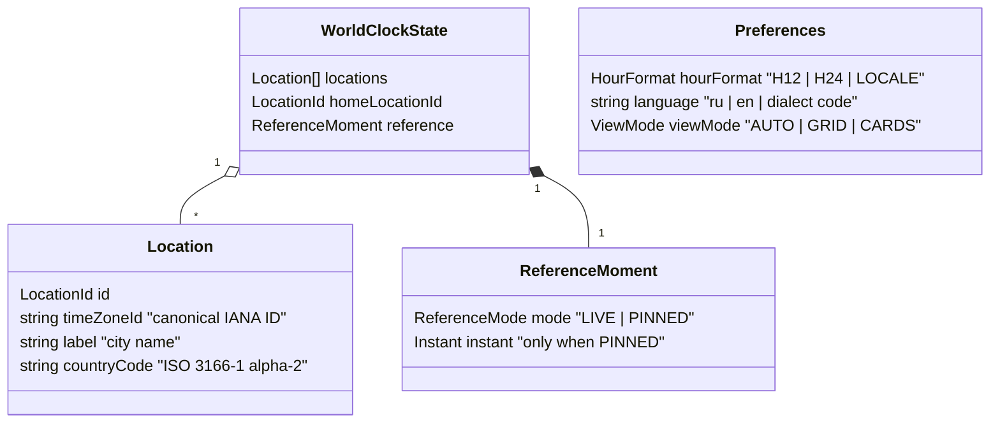
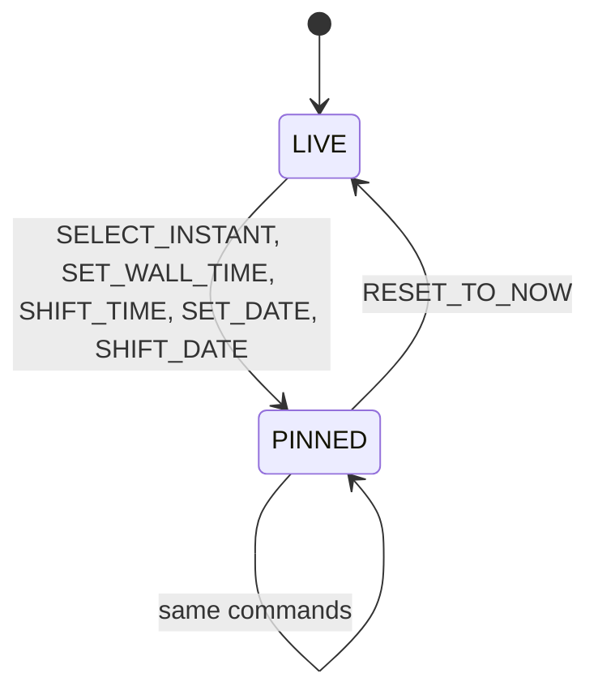

# Domain Model

The model is pure TypeScript with no dependency on React, the DOM, i18n or the presenter ([ADR-0002](../adr/0002-model-presenter-swappable-views.md)). Time semantics follow [ADR-0003](../adr/0003-reference-instant-time-model.md).

## State

- `locations` order is the display order.
- `reference` is not persisted; the app always starts in `LIVE`.
- `Preferences` is a separate model with its own repository.
- `HourFormat.LOCALE` follows the conventions of the active language.

## Invariants

1. If `locations` is not empty, `homeLocationId` points to an existing location.
2. No two locations share the same canonical `timeZoneId` and `label`.
3. Every `timeZoneId` is a valid, canonical IANA identifier.
4. `reference.instant` is present if and only if `reference.mode` is `PINNED`.

## Commands

Commands are serializable objects with a `type` enum. The reducer returns either a new state or a typed error; it never throws for expected failures.

| Command | Effect | Errors |
|---|---|---|
| `ADD_LOCATION(timeZoneId, label, countryCode)` | appends a location; the first one becomes home | `DUPLICATE_LOCATION`, `UNKNOWN_TIME_ZONE` |
| `REMOVE_LOCATION(id)` | removes it; if it was home, the first remaining becomes home | `LOCATION_NOT_FOUND` |
| `SET_HOME_LOCATION(id)` | changes the reference location | `LOCATION_NOT_FOUND` |
| `SELECT_INSTANT(instant)` | pins the moment (grid cell, slider) | — |
| `SET_WALL_TIME(timeZoneId, time, date?)` | pins the moment for a wall-clock time in a zone; the zone need not be in the list | `UNKNOWN_TIME_ZONE` |
| `SHIFT_TIME(duration)` | moves the moment by a duration (keyboard: ±1 h, ±15 min) | — |
| `SET_DATE(date)` | changes the date, keeping the home wall-clock time | — |
| `SHIFT_DATE(days)` | previous / next day | — |
| `RESET_TO_NOW()` | switches to `LIVE` | — |

Preferences commands: `SET_HOUR_FORMAT`, `SET_LANGUAGE`, `SET_VIEW_MODE`.

`SET_WALL_TIME` and `SET_DATE` resolve wall-clock time with `disambiguation: "compatible"` and report `UNIQUE | GAP | AMBIGUOUS`, so a view can explain why the time moved.

### Reference moment lifecycle

## Selectors

Selectors take the state and the current instant from the `Clock` and return view-agnostic values. They are memoized so that unchanged locations keep the same object between clock ticks.

| Selector | Returns | Used by |
|---|---|---|
| `getEffectiveInstant(state, now)` | `now` in `LIVE`, the pinned instant otherwise | all |
| `getLocationSnapshot(location)` | `ZonedDateTime`, UTC offset, offset difference from home, day shift from home (`-1 / 0 / +1`), day period, is-home flag | all views |
| `getHourCells(location)` | 24 cells: start instant, local start time, day period, is-midnight flag with the new date | grid |
| `getDayProgress(location)` | position within the local day (0..1) and day-period boundaries | cards |
| `getDayPeriod(zonedDateTime)` | `NIGHT / MORNING / WORK / EVENING` | colors in all views |

Hour cells are one-hour spans of absolute time starting at the home location's local midnight, so 23- and 25-hour days and :30 / :45 offsets stay aligned.

## Out of the model

- Formatting and localized strings — presenter.
- Timers, persistence, cross-tab sync — controller via ports.
- Scroll position, open panels, focus — views.
- City search data — `CitySearch` port and its adapter.
