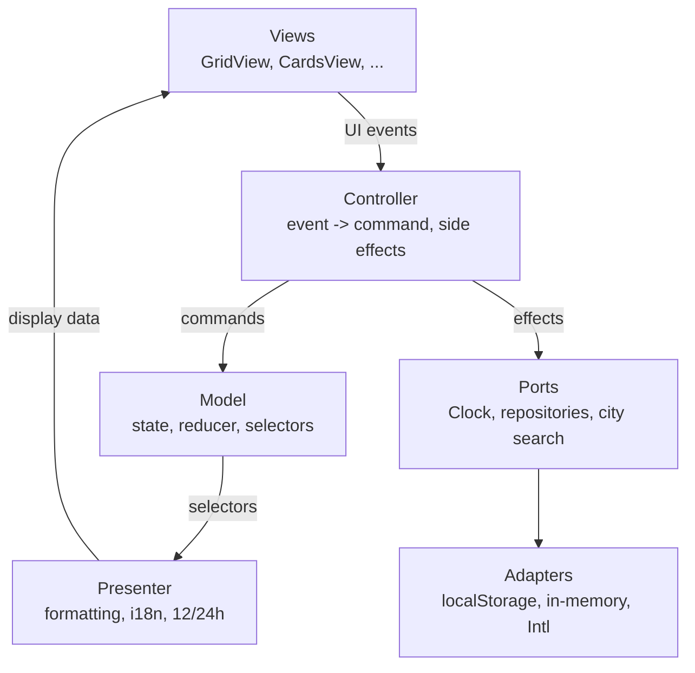
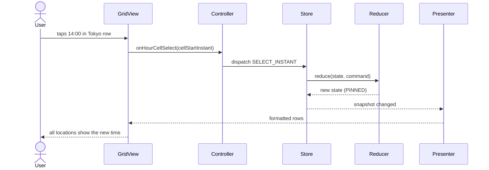

# Architecture Overview

Time Zones is a client-only, offline-first PWA. The architecture separates a view-independent domain model from interchangeable interfaces, so the same logic serves planning, converting and glancing on phones, tablets and desktops.

## Documents

| Document | What it covers |
|---|---|
| [domain-model.md](domain-model.md) | State, invariants, commands, errors, selectors |
| [views.md](views.md) | View catalog, view contract, UX building blocks |
| [open-questions.md](open-questions.md) | Decisions not made yet |
| [ADR-0002](../adr/0002-model-presenter-swappable-views.md) | Model, presenter, swappable views |
| [ADR-0003](../adr/0003-reference-instant-time-model.md) | Reference instant, DST, hour cells, time zone IDs |
| [ADR-0004](../adr/0004-local-persistence-strategy.md) | Persistence, migrations, cross-tab sync |
| [ADR-0005](../adr/0005-view-registry.md) | View registry: adding a view without touching other layers |
| [ADR-0006](../adr/0006-city-data-sources.md) | Pluggable city data sources for search |

## Layers



Dependency rule: arrows point from outer to inner layers. The model imports nothing from React, the DOM, i18n or the presenter.

## Data flow of one interaction



All conversions are synchronous: the UI updates in the same frame, without loading states.

## Where things live

Target layout inside `packages/client/src/` (to be created by the first implementing changes):

```
src/
  lib/temporal.ts          Temporal re-export, Clock port (exists)
  model/                   pure TS: state, commands, reducer, selectors, invariants
    index.ts               public API of the model
  preferences/             preferences model (language, hour format, view mode)
  ports/                   repository and search interfaces
  adapters/                localStorage, in-memory implementations
    city-search/           composite adapter + city sources (zone cities, abbreviations, ...)
  presenter/               formatting and i18n of selector output
  controller/              hooks: dispatch, clock tick, persistence, cross-tab sync
  views/
    index.ts               viewRegistry: every available view
    cards/                 CardsView (first release)
    grid/                  GridView (next)
    shared/                row header, time display, day-period colors
  components/ui/           shadcn/ui primitives
  locales/                 ru.json, en.json, dialects
```

Each folder is a module with an `index.ts`; imports go only through it.

## Kinds of state

| Kind | Owner | Persisted |
|---|---|---|
| Domain: locations, home, reference moment | `model/` | yes, except the reference moment |
| Preferences: language, hour format, view mode | `preferences/` | yes |
| View: scroll, open sheet, focus | the view | no |

## Testing strategy by layer

| Layer | Tests |
|---|---|
| Model, presenter | Vitest (TDD), vitest-cucumber BDD, Stryker >= 95% |
| Adapters | shared contract tests per port |
| Views | Storybook stories for every UI state, contract BDD E2E per view, axe-core, visual regression |
